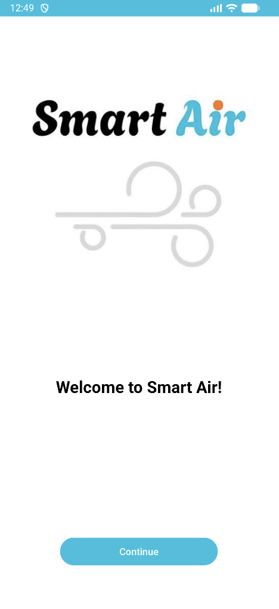
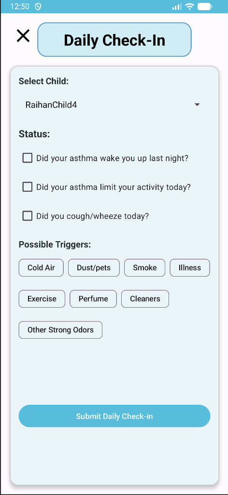
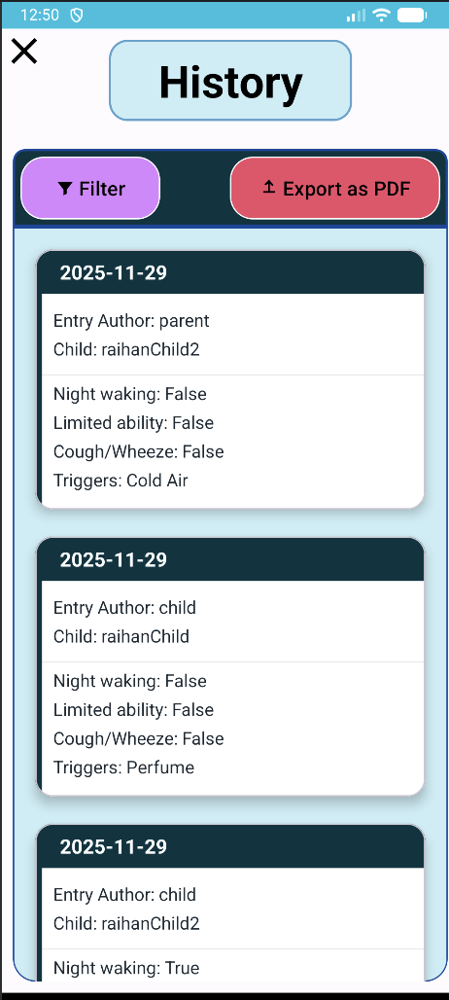
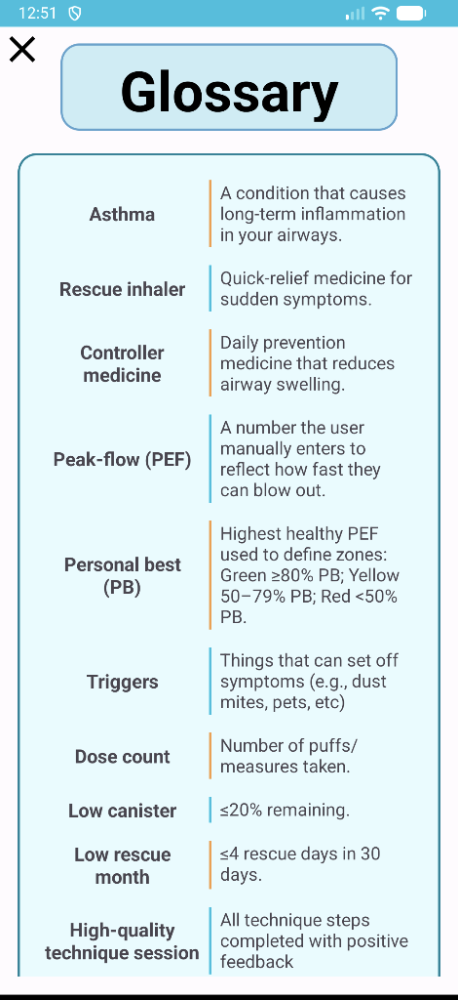
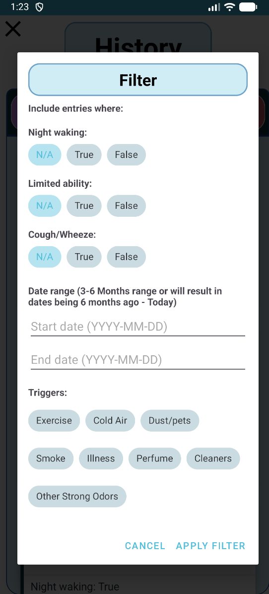

## 📱🌬️ Smart Air — Asthma Support & Daily Health Management App
---
### 📖 Description

SMART AIR is a kid-friendly Android app designed to help children (ages 6–16) understand asthma, practice correct inhaler technique, log symptoms and medication use, and share parent-approved health information with healthcare providers through a secure, controlled interface.

The system supports multiple user roles (Child, Parent, Provider) and implements selective sharing, safety features, and actionable asthma insights aligned with modern pediatric asthma guidelines.

---
### 📸 App Screenshots
<p float="left">
  
  
  
  
  

</p>

---

### ⭐ Core Objectives

- Empower children to track asthma symptoms independently
- Give parents tools to monitor trends, alerts, and medication use
- Provide healthcare providers with concise reports when authorized
- Support safe decision-making through triage and peak-flow zone guidance
- Maintain child privacy using a parent-controlled sharing model

---
### 👥 User Roles 

#### 👩‍👦 Parent
- Adds and manages one or more children
- Controls sharing settings with Providers
- Views dashboards, alerts, trends
- Manages inventory, medicine schedules, PB (Personal Best) values
- Access to children history and all children information

##### 👦 Child
- Logs symptoms, triggers, medications
- Uses technique helpers
- Sees simple guidance + gamified motivators such as badges and streaks 🔥

#### 🩺 Provider (read-only)
- Accesses only the data a Parent explicitly shares
- Views reports, summaries, and trends for selected children

---

### 🔒 Privacy & Access Model
- Children see only their own data
- Providers see nothing until a Parent explicitly toggles sharing on
- Provider invites are secure, one-time links that expire in 7 days
- Sharing can be revoked instantly
---
### 🗝️ API Keys & Firebase Configuration
SMART AIR uses Firebase Authentication and Firebase Firestore. To get the API_KEY needed to access 
the database and log-in go to app/google-services.json and then ask one of the team members for the
key! Then Rebuild, sync Gradle and you should be good to go!
#### Warning ⚠️: Without this API_KEY, the app cannot connect to the database or authenticate users.

---
### 🛠️ Setup Instructions
1. Clone the repo in Android Studio.
2. Add API_KEY to app/google-services.json
3. Connect an android device or emulator
4. Press run!
--- 
### 🧱System Structure and How Components Interact
Smart air was built with an MVP architecture which separates UI, business logic, and 
database access. With the MVP architecture, we built in a readable and maintainable way to make 
the code as scalable as possible. For our data, Our data is stored in Firebase firestore and is 
accessed through our model classes which deal with the database logic. Following the MVP 
architecture, the system interacts as follows:
```
View -> Presenter -> Model -> Presenter -> View
```
---
### 👨‍💻Key Modules I worked on
``` 
2. Daily Check-in Module
Daily simple kid-friendly logging of asthma symptoms and triggers for each child. A child user can 
either submit it themselves or a parent can submit it on their behalf. 

Responsibilities:
- Record daily symptoms (cough/wheeze, night waking, activity limits)
- Only allows one submission per child each day.
- Allow multiple trigger selections (e.g., exercise, cold air, dust/pets, smoke, illness, strong 
odors)
- Store entries in Firestore with timestamps, entry autry author, parentId and data given by 
check-in.
- Provide data to the History module.

3. Parent History Module
Provides a 3–6 month history view so parents and providers can see patterns in symptoms, 
triggers, and medication use over time. Uses the data from Daily check-in.

Responsibilites:
- Retrieve check-in entries from Firestore for a selected date range (3–6 months)
- Can Filter data by symptoms, dates, and triggers
- Be able to export selected data as PDF

4. Glossary
Explain key concepts used in the app.
```
--- 
### 🎨 Design choices and Assumptions
#### Design Choices
- MVP architecture was chosen since it's easier to separate UI, Business logic and database logic
making our code more readable and easier to maintain.
- Daily check-in design was made as simple as possible so kids would actually do it daily without 
losing interest and could complete it very quickly.
- History export as pdf feature was chosen to export to the downloads folder in files because it 
would give the user the most freedom on what they do with it.
#### Assumptions
- If child has more then one parent then parents share one account.
- We assume users have reliable internet for firebase-sync.
- Children are ages 6-16
- Providers are read-only and will never need to edit data.
- Parents will enter Personal Best (PB) for peak-flow calculations.
- Parents are administrators of child accounts and have access to all child credentials.
- When a child is logged in under a parent profile, logout should return user to login screen to prevent accidental access to parent account.
--- 
### 🔑 Sample Credentials
``` 
// 👩‍👦 Parent 
email: krishpatel8976@gmail.com
password: Abcd123$

// ‍👦 Child
username: RaihansChild3
password: Password123!

// 🩺 Provider 
email: drsteve@gmail.com
password: Password123!
```
---
### 💻 Tech Stack
- Java (Android)
- Firebase Authentication
- Firebase Firestore

---
### 📂 Contributors
- Raihan Carder 
- Kyrina Mollison
- Krish Patel
- Arshdip Pamma
- Ved Thakar
